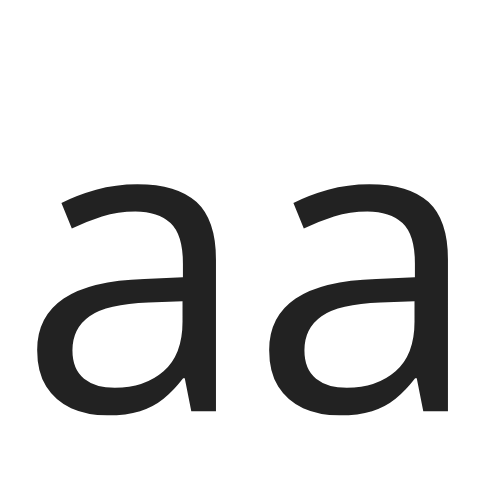

# AA Game 🕹️

<p align="center">
  
</p>

<p align="center">
  A highly customizable, minimalist, and addictive skill game developed with modern web technologies.
</p>

<p align="center">
  <a href="https://turgutoaydin.github.io/aagame/"><strong>Play the Game »</strong></a>
</p>

---

## 🎮 About The Game

AA Game is a web-based game that combines the classic "pin shooting" concept with a modern interface, fluid animations, and deep customization options. The goal is to shoot all your pins into a rotating circle without hitting other pins or obstacles. Test your reflexes with increasing difficulty and new mechanics in every level!

This project was developed entirely using HTML, CSS, and vanilla JavaScript, aiming for clean code and a modular structure.

---

## ✨ Key Features

* **Advanced Customization:** Players can shape their gaming experience entirely to their liking:
    * **Themes:** Light, Dark, Synthwave, Forest, and many other color palettes.
    * **Pin Styles:** Different pin appearances like the classic needle, a mythic arrow, or a fun balloon.
    * **Effects:** Change particle effects for hits and power-ups (sparks, bubbles, etc.).
    * **Detailed Settings:** Control many details like pin placement on the circle, as well as circle and background styles.
* **Multi-Language Support:** Instantly switch between Turkish, English, and Kurdish.
* **Dynamic Difficulty:** The game adapts its difficulty level based on the player's performance.
* **Modern Interface:** A clean, minimalist, and user-friendly design.
* **Sound Effects:** Satisfying sound effects integrated with Tone.js.
* **Mobile Friendly:** Provides a seamless gaming experience on all devices.

---

## 🛠️ Technologies Used

* **Frontend:** HTML5, CSS3, JavaScript (ES6+ Modules)
* **Styling:** [Tailwind CSS](https://tailwindcss.com/)
* **Audio:** [Tone.js](https://tonejs.github.io/)

---

## 📁 Folder Structure

The project is organized in a modular structure for better code management:

/aagame├── assets/│   └── images/│       └── logo.png├── css/│   └── style.css├── js/│   ├── constants.js     # All static data, translations, and settings options│   ├── settings.js      # Manages settings (save, load, apply)│   ├── sound.js         # Sound effects manager│   ├── level.js         # Level and difficulty management│   ├── game.js          # Main game class and logic│   └── main.js          # The starting point of the game└── index.html           # Main HTML file
---

## 🚀 Running Locally

You can run the project on your local machine by following these steps:

1.  **Clone the Project:**
    ```bash
    git clone [https://github.com/turgutoaydin/aagame.git](https://github.com/turgutoaydin/aagame.git)
    ```

2.  **Navigate to the Directory:**
    ```bash
    cd aagame
    ```

3.  **Open `index.html`:**
    * Simply open the `index.html` file in any modern web browser (`Google Chrome`, `Firefox`, etc.).
    * For a better experience, you can run the project with an extension like [Live Server](https://marketplace.visualstudio.com/items?itemName=ritwickdey.LiveServer).

---

## 👤 Author

* **LiraKurdi** - [Telegram](https://t.me/LiraKurdi)
